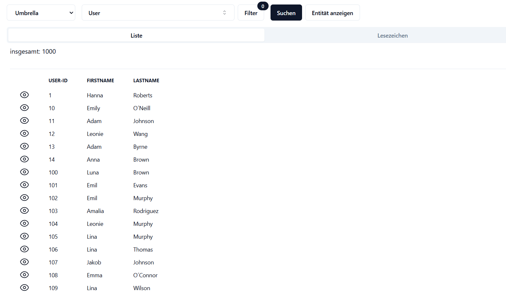

# DaVi

DaVi or Data Viewer is a web application to view raw data from a database. In contrast to classic database administration, such as adminer or PHPMyAdmin, it's not all about tables, but about entities.

In order to use DaVi you must first create an entity. Then you specify which columns/properties this entity should have. With this information, DaVi can then read the data from the database. So just like in any database management software.

But DaVi can do even more. You can define additional handlers for each column that can, for example, format or validate the data.

## Configuration

Entities are configured with yaml files. In this example this user entity has four properties.
<pre>
properties:
  usr_id:
    preDefined: "Integer"
    column: "usr_id"
    label: "User ID"
  name:
    preDefined: "String"
    column: "name"
    label: "Name"
  active:
    preDefined: "Integer"
    column: "active"
    label: "Active"
    settings:
      options:
        0:
          label: 'inactive'
        1:
          label: 'active'
    handler:
      valueFormatterItemHandler: "OptionsValueFormatterItemHandler"
  inactivation_date:
    preDefined: "Date"
    column: "inactivation_date"
    label: "Inactivation date"
    handler:
      valueFormatterItemHandler: "DateTimeValueFormatterItemHandler"
</pre>
The active and inactivation date columns have each an item handler, which formats the raw data. In the first case this shows what the raw values 0 and 1 mean and in the second case the date is converted from the standard database format to an easier to read format.

Another example with two columns. One contains HTML and the other JSON. The JSON column must contain a valid JSON object, otherwise an error will occur.
<pre>
properties:
  description:
    preDefined: "HtmlItem"
    label: "Description"
    column: "description"
    length: 65535
    handler:
      preRenderingItemHandler: "HtmlPreRenderingItemHandler"
  parameter:
    preDefined: "JsonItem"
    label: "parameter"
    column: "parameter"
    length: 65535
    handler:
      preRenderingItemHandler: "JsonPreRenderingItemHandler"
      validatorItemHandler
        JsonValidatorItemHandler: 
          jsonType: "jsonObject" 
          jsonMandatory: true 
          logCode: "INT-2000"
</pre>

## Frontend
There is a frontend developed with react, but it is currently not publicly available.

Here are two example pictures. The shows all found entities and the second the data of the selected entity.

## License

Symfony Docker is available under the MIT License.

Symfony skeleton is available under the MIT License.

## Credits

DaVi builds on top of Symfony and FrankenPHP: https://github.com/dunglas/symfony-docker
